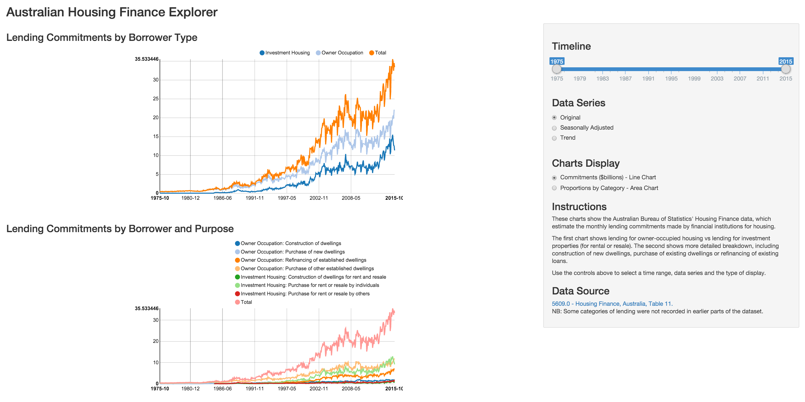

<!-- Limit image width and height -->

## What is Housing Finance data?

* [5609.0 Housing Finance](http://www.abs.gov.au/ausstats/abs@.nsf/mf/5609.0): Australian Bureau of Statistics dataset based on records from financial institutions and regulators.
* Provides monthly records of loan commitments related to housing.
* Changes over time indicate trends in economic activity and in the housing sector.
* Records (except in earlier years) provide a breakdown of lending:
  * by borrower type (owner-occupier vs property investor)
  * loan purpose (construction of new housing, purchase of existing house, refinancing, etc.)

*Exploring the Housing Finance dataset allows us to draw conclusions about trends in housing activity and the changing nature of the housing market, and to consider the implications for housing policy.*

--- .class #id 

## Screenshot of the App

---

## Sample Interactive Chart: Proportional Rise in Investment Properties, 1992-2015 (Trend Data)

<script type='text/javascript'>
 $(document).ready(function(){
      drawchart1b5b5beeab17()
    });
    function drawchart1b5b5beeab17(){  
      var opts = {
 "dom": "chart1b5b5beeab17",
"width":    800,
"height":    400,
"x": "data_month",
"y": "prop",
"group": "borrower_type",
"type": "stackedAreaChart",
"id": "chart1b5b5beeab17" 
},
        data = [
 {
 "data_month":           8035,
"borrower_type": "Investment Housing",
"commitments":       0.432885,
"prop": 0.1584255562562 
},
{
 "data_month":           8035,
"borrower_type": "Owner Occupation",
"commitments":       2.299534,
"prop": 0.8415744437438 
},
{
 "data_month":           8066,
"borrower_type": "Investment Housing",
"commitments":        0.45171,
"prop": 0.1596467139199 
},
{
 "data_month":           8066,
"borrower_type": "Owner Occupation",
"commitments":       2.377725,
"prop": 0.8403532860801 
},
{
 "data_month":           8095,
"borrower_type": "Investment Housing",
"commitments":       0.472027,
"prop": 0.1580641596625 
},
{
 "data_month":           8095,
"borrower_type": "Owner Occupation",
"commitments":       2.514273,
"prop": 0.8419358403375 
},
{
 "data_month":           8126,
"borrower_type": "Investment Housing",
"commitments":       0.491339,
"prop": 0.1585504610603 
},
{
 "data_month":           8126,
"borrower_type": "Owner Occupation",
"commitments":       2.607605,
"prop": 0.8414495389397 
},
{
 "data_month":           8156,
"borrower_type": "Investment Housing",
"commitments":       0.507908,
"prop": 0.1578766101358 
},
{
 "data_month":           8156,
"borrower_type": "Owner Occupation",
"commitments":       2.709212,
"prop": 0.8421233898642 
},
{
 "data_month":           8187,
"borrower_type": "Investment Housing",
"commitments":       0.520211,
"prop": 0.1559467765685 
},
{
 "data_month":           8187,
"borrower_type": "Owner Occupation",
"commitments":       2.815613,
"prop": 0.8440532234315 
},
{
 "data_month":           8217,
"borrower_type": "Investment Housing",
"commitments":       0.529832,
"prop": 0.159969855746 
},
{
 "data_month":           8217,
"borrower_type": "Owner Occupation",
"commitments":       2.782242,
"prop": 0.840030144254 
},
{
 "data_month":           8248,
"borrower_type": "Investment Housing",
"commitments":       0.539743,
"prop": 0.1588555424454 
},
{
 "data_month":           8248,
"borrower_type": "Owner Occupation",
"commitments":       2.857954,
"prop": 0.8411444575546 
},
{
 "data_month":           8279,
"borrower_type": "Investment Housing",
"commitments":       0.549825,
"prop": 0.1590422608545 
},
{
 "data_month":           8279,
"borrower_type": "Owner Occupation",
"commitments":       2.907275,
"prop": 0.8409577391455 
},
{
 "data_month":           8309,
"borrower_type": "Investment Housing",
"commitments":       0.563195,
"prop": 0.1610200965271 
},
{
 "data_month":           8309,
"borrower_type": "Owner Occupation",
"commitments":       2.934474,
"prop": 0.8389799034729 
},
{
 "data_month":           8340,
"borrower_type": "Investment Housing",
"commitments":       0.580525,
"prop": 0.164295823896 
},
{
 "data_month":           8340,
"borrower_type": "Owner Occupation",
"commitments":       2.952888,
"prop": 0.835704176104 
},
{
 "data_month":           8370,
"borrower_type": "Investment Housing",
"commitments":       0.600749,
"prop": 0.1679214324847 
},
{
 "data_month":           8370,
"borrower_type": "Owner Occupation",
"commitments":       2.976811,
"prop": 0.8320785675153 
},
{
 "data_month":           8401,
"borrower_type": "Investment Housing",
"commitments":       0.627022,
"prop": 0.171871089693 
},
{
 "data_month":           8401,
"borrower_type": "Owner Occupation",
"commitments":       3.021189,
"prop": 0.828128910307 
},
{
 "data_month":           8432,
"borrower_type": "Investment Housing",
"commitments":       0.661428,
"prop": 0.1765467068253 
},
{
 "data_month":           8432,
"borrower_type": "Owner Occupation",
"commitments":       3.085048,
"prop": 0.8234532931747 
},
{
 "data_month":           8460,
"borrower_type": "Investment Housing",
"commitments":       0.702031,
"prop": 0.181820701108 
},
{
 "data_month":           8460,
"borrower_type": "Owner Occupation",
"commitments":       3.159086,
"prop": 0.818179298892 
},
{
 "data_month":           8491,
"borrower_type": "Investment Housing",
"commitments":       0.745224,
"prop": 0.1874082415728 
},
{
 "data_month":           8491,
"borrower_type": "Owner Occupation",
"commitments":        3.23125,
"prop": 0.8125917584272 
},
{
 "data_month":           8521,
"borrower_type": "Investment Housing",
"commitments":       0.787362,
"prop": 0.1923936573004 
},
{
 "data_month":           8521,
"borrower_type": "Owner Occupation",
"commitments":       3.305091,
"prop": 0.8076063426996 
},
{
 "data_month":           8552,
"borrower_type": "Investment Housing",
"commitments":       0.827562,
"prop": 0.1967189499727 
},
{
 "data_month":           8552,
"borrower_type": "Owner Occupation",
"commitments":       3.379262,
"prop": 0.8032810500273 
},
{
 "data_month":           8582,
"borrower_type": "Investment Housing",
"commitments":       0.865792,
"prop": 0.2001205172116 
},
{
 "data_month":           8582,
"borrower_type": "Owner Occupation",
"commitments":       3.460561,
"prop": 0.7998794827884 
},
{
 "data_month":           8613,
"borrower_type": "Investment Housing",
"commitments":       0.901969,
"prop": 0.2026810091255 
},
{
 "data_month":           8613,
"borrower_type": "Owner Occupation",
"commitments":       3.548221,
"prop": 0.7973189908745 
},
{
 "data_month":           8644,
"borrower_type": "Investment Housing",
"commitments":       0.938575,
"prop": 0.2049523985048 
},
{
 "data_month":           8644,
"borrower_type": "Owner Occupation",
"commitments":       3.640903,
"prop": 0.7950476014952 
},
{
 "data_month":           8674,
"borrower_type": "Investment Housing",
"commitments":       0.976104,
"prop": 0.2068755477326 
},
{
 "data_month":           8674,
"borrower_type": "Owner Occupation",
"commitments":       3.742211,
"prop": 0.7931244522674 
},
{
 "data_month":           8705,
"borrower_type": "Investment Housing",
"commitments":       1.013145,
"prop": 0.2081721668237 
},
{
 "data_month":           8705,
"borrower_type": "Owner Occupation",
"commitments":       3.853716,
"prop": 0.7918278331763 
},
{
 "data_month":           8735,
"borrower_type": "Investment Housing",
"commitments":       1.050836,
"prop": 0.2089239769826 
},
{
 "data_month":           8735,
"borrower_type": "Owner Occupation",
"commitments":       3.978917,
"prop": 0.7910760230174 
},
{
 "data_month":           8766,
"borrower_type": "Investment Housing",
"commitments":       1.085963,
"prop": 0.2089574208773 
},
{
 "data_month":           8766,
"borrower_type": "Owner Occupation",
"commitments":       4.111091,
"prop": 0.7910425791227 
},
{
 "data_month":           8797,
"borrower_type": "Investment Housing",
"commitments":       1.117106,
"prop": 0.2087719635953 
},
{
 "data_month":           8797,
"borrower_type": "Owner Occupation",
"commitments":       4.233737,
"prop": 0.7912280364047 
},
{
 "data_month":           8825,
"borrower_type": "Investment Housing",
"commitments":       1.147439,
"prop": 0.2098510316807 
},
{
 "data_month":           8825,
"borrower_type": "Owner Occupation",
"commitments":       4.320435,
"prop": 0.7901489683193 
},
{
 "data_month":           8856,
"borrower_type": "Investment Housing",
"commitments":       1.176606,
"prop": 0.2130569220874 
},
{
 "data_month":           8856,
"borrower_type": "Owner Occupation",
"commitments":        4.34589,
"prop": 0.7869430779126 
},
{
 "data_month":           8886,
"borrower_type": "Investment Housing",
"commitments":       1.200882,
"prop": 0.2183979328541 
},
{
 "data_month":           8886,
"borrower_type": "Owner Occupation",
"commitments":       4.297714,
"prop": 0.7816020671459 
},
{
 "data_month":           8917,
"borrower_type": "Investment Housing",
"commitments":       1.216868,
"prop": 0.2253859945472 
},
{
 "data_month":           8917,
"borrower_type": "Owner Occupation",
"commitments":       4.182172,
"prop": 0.7746140054528 
},
{
 "data_month":           8947,
"borrower_type": "Investment Housing",
"commitments":       1.223686,
"prop": 0.2326643846777 
},
{
 "data_month":           8947,
"borrower_type": "Owner Occupation",
"commitments":       4.035761,
"prop": 0.7673356153223 
},
{
 "data_month":           8978,
"borrower_type": "Investment Housing",
"commitments":       1.221029,
"prop": 0.2390447754883 
},
{
 "data_month":           8978,
"borrower_type": "Owner Occupation",
"commitments":       3.886922,
"prop": 0.7609552245117 
},
{
 "data_month":           9009,
"borrower_type": "Investment Housing",
"commitments":       1.211684,
"prop": 0.243778064674 
},
{
 "data_month":           9009,
"borrower_type": "Owner Occupation",
"commitments":       3.758755,
"prop": 0.756221935326 
},
{
 "data_month":           9039,
"borrower_type": "Investment Housing",
"commitments":       1.198534,
"prop": 0.2470107599657 
},
{
 "data_month":           9039,
"borrower_type": "Owner Occupation",
"commitments":       3.653619,
"prop": 0.7529892400343 
},
{
 "data_month":           9070,
"borrower_type": "Investment Housing",
"commitments":       1.183006,
"prop": 0.2492064090592 
},
{
 "data_month":           9070,
"borrower_type": "Owner Occupation",
"commitments":       3.564087,
"prop": 0.7507935909408 
},
{
 "data_month":           9100,
"borrower_type": "Investment Housing",
"commitments":       1.165192,
"prop": 0.2513304839526 
},
{
 "data_month":           9100,
"borrower_type": "Owner Occupation",
"commitments":       3.470903,
"prop": 0.7486695160474 
},
{
 "data_month":           9131,
"borrower_type": "Investment Housing",
"commitments":       1.148147,
"prop": 0.2538203584289 
},
{
 "data_month":           9131,
"borrower_type": "Owner Occupation",
"commitments":       3.375316,
"prop": 0.7461796415711 
},
{
 "data_month":           9162,
"borrower_type": "Investment Housing",
"commitments":       1.135204,
"prop": 0.2559186041033 
},
{
 "data_month":           9162,
"borrower_type": "Owner Occupation",
"commitments":       3.300597,
"prop": 0.7440813958967 
},
{
 "data_month":           9190,
"borrower_type": "Investment Housing",
"commitments":       1.130761,
"prop": 0.2569456453051 
},
{
 "data_month":           9190,
"borrower_type": "Owner Occupation",
"commitments":       3.270018,
"prop": 0.7430543546949 
},
{
 "data_month":           9221,
"borrower_type": "Investment Housing",
"commitments":       1.135729,
"prop": 0.2565548925804 
},
{
 "data_month":           9221,
"borrower_type": "Owner Occupation",
"commitments":       3.291117,
"prop": 0.7434451074196 
},
{
 "data_month":           9251,
"borrower_type": "Investment Housing",
"commitments":       1.148216,
"prop": 0.2549124691354 
},
{
 "data_month":           9251,
"borrower_type": "Owner Occupation",
"commitments":       3.356138,
"prop": 0.7450875308646 
},
{
 "data_month":           9282,
"borrower_type": "Investment Housing",
"commitments":       1.162613,
"prop": 0.2522976931924 
},
{
 "data_month":           9282,
"borrower_type": "Owner Occupation",
"commitments":       3.445487,
"prop": 0.7477023068076 
},
{
 "data_month":           9312,
"borrower_type": "Investment Housing",
"commitments":       1.174067,
"prop": 0.2497711448247 
},
{
 "data_month":           9312,
"borrower_type": "Owner Occupation",
"commitments":       3.526504,
"prop": 0.7502288551753 
},
{
 "data_month":           9343,
"borrower_type": "Investment Housing",
"commitments":       1.180358,
"prop": 0.2481356057623 
},
{
 "data_month":           9343,
"borrower_type": "Owner Occupation",
"commitments":       3.576549,
"prop": 0.7518643942377 
},
{
 "data_month":           9374,
"borrower_type": "Investment Housing",
"commitments":       1.182971,
"prop": 0.2472916924051 
},
{
 "data_month":           9374,
"borrower_type": "Owner Occupation",
"commitments":       3.600736,
"prop": 0.7527083075949 
},
{
 "data_month":           9404,
"borrower_type": "Investment Housing",
"commitments":       1.184815,
"prop": 0.2469456288801 
},
{
 "data_month":           9404,
"borrower_type": "Owner Occupation",
"commitments":       3.613063,
"prop": 0.7530543711199 
},
{
 "data_month":           9435,
"borrower_type": "Investment Housing",
"commitments":       1.192557,
"prop": 0.2473087150744 
},
{
 "data_month":           9435,
"borrower_type": "Owner Occupation",
"commitments":       3.629582,
"prop": 0.7526912849256 
},
{
 "data_month":           9465,
"borrower_type": "Investment Housing",
"commitments":       1.206886,
"prop": 0.2481806251123 
},
{
 "data_month":           9465,
"borrower_type": "Owner Occupation",
"commitments":       3.656048,
"prop": 0.7518193748877 
},
{
 "data_month":           9496,
"borrower_type": "Investment Housing",
"commitments":       1.221353,
"prop": 0.249299774205 
},
{
 "data_month":           9496,
"borrower_type": "Owner Occupation",
"commitments":       3.677781,
"prop": 0.750700225795 
},
{
 "data_month":           9527,
"borrower_type": "Investment Housing",
"commitments":       1.228129,
"prop": 0.2501189875155 
},
{
 "data_month":           9527,
"borrower_type": "Owner Occupation",
"commitments":        3.68205,
"prop": 0.7498810124845 
},
{
 "data_month":           9556,
"borrower_type": "Investment Housing",
"commitments":        1.22217,
"prop": 0.2496118993171 
},
{
 "data_month":           9556,
"borrower_type": "Owner Occupation",
"commitments":       3.674111,
"prop": 0.7503881006829 
},
{
 "data_month":           9587,
"borrower_type": "Investment Housing",
"commitments":        1.20856,
"prop": 0.2473103141186 
},
{
 "data_month":           9587,
"borrower_type": "Owner Occupation",
"commitments":       3.678256,
"prop": 0.7526896858814 
},
{
 "data_month":           9617,
"borrower_type": "Investment Housing",
"commitments":       1.199933,
"prop": 0.2443769292854 
},
{
 "data_month":           9617,
"borrower_type": "Owner Occupation",
"commitments":        3.71024,
"prop": 0.7556230707146 
},
{
 "data_month":           9648,
"borrower_type": "Investment Housing",
"commitments":       1.206518,
"prop": 0.2426324981926 
},
{
 "data_month":           9648,
"borrower_type": "Owner Occupation",
"commitments":       3.766097,
"prop": 0.7573675018074 
},
{
 "data_month":           9678,
"borrower_type": "Investment Housing",
"commitments":       1.229519,
"prop": 0.2428456447951 
},
{
 "data_month":           9678,
"borrower_type": "Owner Occupation",
"commitments":       3.833446,
"prop": 0.7571543552049 
},
{
 "data_month":           9709,
"borrower_type": "Investment Housing",
"commitments":       1.274864,
"prop": 0.2460706527802 
},
{
 "data_month":           9709,
"borrower_type": "Owner Occupation",
"commitments":       3.906022,
"prop": 0.7539293472198 
},
{
 "data_month":           9740,
"borrower_type": "Investment Housing",
"commitments":       1.341722,
"prop": 0.2525853475792 
},
{
 "data_month":           9740,
"borrower_type": "Owner Occupation",
"commitments":       3.970233,
"prop": 0.7474146524208 
},
{
 "data_month":           9770,
"borrower_type": "Investment Housing",
"commitments":       1.424408,
"prop": 0.2617246721156 
},
{
 "data_month":           9770,
"borrower_type": "Owner Occupation",
"commitments":       4.017983,
"prop": 0.7382753278844 
},
{
 "data_month":           9801,
"borrower_type": "Investment Housing",
"commitments":       1.518138,
"prop": 0.2722283469029 
},
{
 "data_month":           9801,
"borrower_type": "Owner Occupation",
"commitments":        4.05857,
"prop": 0.7277716530971 
},
{
 "data_month":           9831,
"borrower_type": "Investment Housing",
"commitments":       1.615862,
"prop": 0.2823748776737 
},
{
 "data_month":           9831,
"borrower_type": "Owner Occupation",
"commitments":       4.106538,
"prop": 0.7176251223263 
},
{
 "data_month":           9862,
"borrower_type": "Investment Housing",
"commitments":       1.713193,
"prop": 0.2912663763625 
},
{
 "data_month":           9862,
"borrower_type": "Owner Occupation",
"commitments":       4.168684,
"prop": 0.7087336236375 
},
{
 "data_month":           9893,
"borrower_type": "Investment Housing",
"commitments":       1.807122,
"prop": 0.2991864400045 
},
{
 "data_month":           9893,
"borrower_type": "Owner Occupation",
"commitments":       4.232998,
"prop": 0.7008135599955 
},
{
 "data_month":           9921,
"borrower_type": "Investment Housing",
"commitments":       1.893277,
"prop": 0.306621190368 
},
{
 "data_month":           9921,
"borrower_type": "Owner Occupation",
"commitments":       4.281368,
"prop": 0.693378809632 
},
{
 "data_month":           9952,
"borrower_type": "Investment Housing",
"commitments":        1.96821,
"prop": 0.3134222616577 
},
{
 "data_month":           9952,
"borrower_type": "Owner Occupation",
"commitments":       4.311529,
"prop": 0.6865777383423 
},
{
 "data_month":           9982,
"borrower_type": "Investment Housing",
"commitments":       2.035027,
"prop": 0.3194924548972 
},
{
 "data_month":           9982,
"borrower_type": "Owner Occupation",
"commitments":       4.334535,
"prop": 0.6805075451028 
},
{
 "data_month":          10013,
"borrower_type": "Investment Housing",
"commitments":       2.092173,
"prop": 0.3237604921372 
},
{
 "data_month":          10013,
"borrower_type": "Owner Occupation",
"commitments":       4.369928,
"prop": 0.6762395078628 
},
{
 "data_month":          10043,
"borrower_type": "Investment Housing",
"commitments":       2.133195,
"prop": 0.325598792113 
},
{
 "data_month":          10043,
"borrower_type": "Owner Occupation",
"commitments":       4.418411,
"prop": 0.674401207887 
},
{
 "data_month":          10074,
"borrower_type": "Investment Housing",
"commitments":        2.15912,
"prop": 0.326093917078 
},
{
 "data_month":          10074,
"borrower_type": "Owner Occupation",
"commitments":        4.46204,
"prop": 0.673906082922 
},
{
 "data_month":          10105,
"borrower_type": "Investment Housing",
"commitments":       2.175781,
"prop": 0.3261594516612 
},
{
 "data_month":          10105,
"borrower_type": "Owner Occupation",
"commitments":       4.495131,
"prop": 0.6738405483388 
},
{
 "data_month":          10135,
"borrower_type": "Investment Housing",
"commitments":       2.190701,
"prop": 0.3267521061309 
},
{
 "data_month":          10135,
"borrower_type": "Owner Occupation",
"commitments":       4.513773,
"prop": 0.6732478938691 
},
{
 "data_month":          10166,
"borrower_type": "Investment Housing",
"commitments":       2.199368,
"prop": 0.3276530277657 
},
{
 "data_month":          10166,
"borrower_type": "Owner Occupation",
"commitments":       4.513123,
"prop": 0.6723469722343 
},
{
 "data_month":          10196,
"borrower_type": "Investment Housing",
"commitments":       2.194609,
"prop": 0.3282778512234 
},
{
 "data_month":          10196,
"borrower_type": "Owner Occupation",
"commitments":       4.490609,
"prop": 0.6717221487766 
},
{
 "data_month":          10227,
"borrower_type": "Investment Housing",
"commitments":       2.179265,
"prop": 0.3278033707747 
},
{
 "data_month":          10227,
"borrower_type": "Owner Occupation",
"commitments":       4.468821,
"prop": 0.6721966292253 
},
{
 "data_month":          10258,
"borrower_type": "Investment Housing",
"commitments":       2.156063,
"prop": 0.3253665624095 
},
{
 "data_month":          10258,
"borrower_type": "Owner Occupation",
"commitments":       4.470503,
"prop": 0.6746334375905 
},
{
 "data_month":          10286,
"borrower_type": "Investment Housing",
"commitments":       2.129921,
"prop": 0.3210225414413 
},
{
 "data_month":          10286,
"borrower_type": "Owner Occupation",
"commitments":       4.504881,
"prop": 0.6789774585587 
},
{
 "data_month":          10317,
"borrower_type": "Investment Housing",
"commitments":       2.106153,
"prop": 0.3164076073526 
},
{
 "data_month":          10317,
"borrower_type": "Owner Occupation",
"commitments":       4.550302,
"prop": 0.6835923926474 
},
{
 "data_month":          10347,
"borrower_type": "Investment Housing",
"commitments":       2.085301,
"prop": 0.3127652496421 
},
{
 "data_month":          10347,
"borrower_type": "Owner Occupation",
"commitments":       4.582003,
"prop": 0.6872347503579 
},
{
 "data_month":          10378,
"borrower_type": "Investment Housing",
"commitments":        2.07001,
"prop": 0.3108199194665 
},
{
 "data_month":          10378,
"borrower_type": "Owner Occupation",
"commitments":       4.589827,
"prop": 0.6891800805335 
},
{
 "data_month":          10408,
"borrower_type": "Investment Housing",
"commitments":       2.062199,
"prop": 0.3105251388909 
},
{
 "data_month":          10408,
"borrower_type": "Owner Occupation",
"commitments":       4.578806,
"prop": 0.6894748611091 
},
{
 "data_month":          10439,
"borrower_type": "Investment Housing",
"commitments":       2.048874,
"prop": 0.3097583509501 
},
{
 "data_month":          10439,
"borrower_type": "Owner Occupation",
"commitments":       4.565553,
"prop": 0.6902416490499 
},
{
 "data_month":          10470,
"borrower_type": "Investment Housing",
"commitments":       2.022498,
"prop": 0.3068778332173 
},
{
 "data_month":          10470,
"borrower_type": "Owner Occupation",
"commitments":       4.568066,
"prop": 0.6931221667827 
},
{
 "data_month":          10500,
"borrower_type": "Investment Housing",
"commitments":        1.99373,
"prop": 0.3019967963404 
},
{
 "data_month":          10500,
"borrower_type": "Owner Occupation",
"commitments":       4.608095,
"prop": 0.6980032036596 
},
{
 "data_month":          10531,
"borrower_type": "Investment Housing",
"commitments":       1.978374,
"prop": 0.2959533266016 
},
{
 "data_month":          10531,
"borrower_type": "Owner Occupation",
"commitments":       4.706376,
"prop": 0.7040466733984 
},
{
 "data_month":          10561,
"borrower_type": "Investment Housing",
"commitments":       1.984282,
"prop": 0.2901043730235 
},
{
 "data_month":          10561,
"borrower_type": "Owner Occupation",
"commitments":       4.855608,
"prop": 0.7098956269765 
},
{
 "data_month":          10592,
"borrower_type": "Investment Housing",
"commitments":        2.00848,
"prop": 0.2848068328229 
},
{
 "data_month":          10592,
"borrower_type": "Owner Occupation",
"commitments":       5.043598,
"prop": 0.7151931671771 
},
{
 "data_month":          10623,
"borrower_type": "Investment Housing",
"commitments":        2.04511,
"prop": 0.2807724465154 
},
{
 "data_month":          10623,
"borrower_type": "Owner Occupation",
"commitments":        5.23876,
"prop": 0.7192275534846 
},
{
 "data_month":          10651,
"borrower_type": "Investment Housing",
"commitments":       2.097372,
"prop": 0.2790169383928 
},
{
 "data_month":          10651,
"borrower_type": "Owner Occupation",
"commitments":       5.419634,
"prop": 0.7209830616072 
},
{
 "data_month":          10682,
"borrower_type": "Investment Housing",
"commitments":       2.158085,
"prop": 0.2794159478593 
},
{
 "data_month":          10682,
"borrower_type": "Owner Occupation",
"commitments":       5.565472,
"prop": 0.7205840521407 
},
{
 "data_month":          10712,
"borrower_type": "Investment Housing",
"commitments":       2.224519,
"prop": 0.2810964652406 
},
{
 "data_month":          10712,
"borrower_type": "Owner Occupation",
"commitments":       5.689202,
"prop": 0.7189035347594 
},
{
 "data_month":          10743,
"borrower_type": "Investment Housing",
"commitments":       2.304656,
"prop": 0.2837900305258 
},
{
 "data_month":          10743,
"borrower_type": "Owner Occupation",
"commitments":       5.816334,
"prop": 0.7162099694742 
},
{
 "data_month":          10773,
"borrower_type": "Investment Housing",
"commitments":       2.396108,
"prop": 0.2866402361828 
},
{
 "data_month":          10773,
"borrower_type": "Owner Occupation",
"commitments":       5.963179,
"prop": 0.7133597638172 
},
{
 "data_month":          10804,
"borrower_type": "Investment Housing",
"commitments":       2.499104,
"prop": 0.2897506844916 
},
{
 "data_month":          10804,
"borrower_type": "Owner Occupation",
"commitments":       6.125911,
"prop": 0.7102493155084 
},
{
 "data_month":          10835,
"borrower_type": "Investment Housing",
"commitments":       2.614984,
"prop": 0.2932438995644 
},
{
 "data_month":          10835,
"borrower_type": "Owner Occupation",
"commitments":       6.302453,
"prop": 0.7067561004356 
},
{
 "data_month":          10865,
"borrower_type": "Investment Housing",
"commitments":       2.732566,
"prop": 0.296871447067 
},
{
 "data_month":          10865,
"borrower_type": "Owner Occupation",
"commitments":       6.471977,
"prop": 0.703128552933 
},
{
 "data_month":          10896,
"borrower_type": "Investment Housing",
"commitments":       2.832348,
"prop": 0.3007438034957 
},
{
 "data_month":          10896,
"borrower_type": "Owner Occupation",
"commitments":       6.585462,
"prop": 0.6992561965043 
},
{
 "data_month":          10926,
"borrower_type": "Investment Housing",
"commitments":        2.89584,
"prop": 0.3045603597629 
},
{
 "data_month":          10926,
"borrower_type": "Owner Occupation",
"commitments":       6.612423,
"prop": 0.6954396402371 
},
{
 "data_month":          10957,
"borrower_type": "Investment Housing",
"commitments":       2.923789,
"prop": 0.3089966143195 
},
{
 "data_month":          10957,
"borrower_type": "Owner Occupation",
"commitments":       6.538415,
"prop": 0.6910033856805 
},
{
 "data_month":          10988,
"borrower_type": "Investment Housing",
"commitments":       2.911152,
"prop": 0.3136695121719 
},
{
 "data_month":          10988,
"borrower_type": "Owner Occupation",
"commitments":       6.369801,
"prop": 0.6863304878281 
},
{
 "data_month":          11017,
"borrower_type": "Investment Housing",
"commitments":       2.854618,
"prop": 0.3169673744183 
},
{
 "data_month":          11017,
"borrower_type": "Owner Occupation",
"commitments":       6.151413,
"prop": 0.6830326255817 
},
{
 "data_month":          11048,
"borrower_type": "Investment Housing",
"commitments":       2.761893,
"prop": 0.3178819311765 
},
{
 "data_month":          11048,
"borrower_type": "Owner Occupation",
"commitments":       5.926531,
"prop": 0.6821180688235 
},
{
 "data_month":          11078,
"borrower_type": "Investment Housing",
"commitments":       2.634271,
"prop": 0.3153526588473 
},
{
 "data_month":          11078,
"borrower_type": "Owner Occupation",
"commitments":       5.719142,
"prop": 0.6846473411527 
},
{
 "data_month":          11109,
"borrower_type": "Investment Housing",
"commitments":       2.481765,
"prop": 0.3093802708393 
},
{
 "data_month":          11109,
"borrower_type": "Owner Occupation",
"commitments":       5.539965,
"prop": 0.6906197291607 
},
{
 "data_month":          11139,
"borrower_type": "Investment Housing",
"commitments":       2.337184,
"prop": 0.3006327970091 
},
{
 "data_month":          11139,
"borrower_type": "Owner Occupation",
"commitments":       5.437031,
"prop": 0.6993672029909 
},
{
 "data_month":          11170,
"borrower_type": "Investment Housing",
"commitments":       2.235898,
"prop": 0.2923978963653 
},
{
 "data_month":          11170,
"borrower_type": "Owner Occupation",
"commitments":       5.410867,
"prop": 0.7076021036347 
},
{
 "data_month":          11201,
"borrower_type": "Investment Housing",
"commitments":       2.191284,
"prop": 0.2865472329742 
},
{
 "data_month":          11201,
"borrower_type": "Owner Occupation",
"commitments":       5.455916,
"prop": 0.7134527670258 
},
{
 "data_month":          11231,
"borrower_type": "Investment Housing",
"commitments":       2.206808,
"prop": 0.2845817914996 
},
{
 "data_month":          11231,
"borrower_type": "Owner Occupation",
"commitments":       5.547757,
"prop": 0.7154182085004 
},
{
 "data_month":          11262,
"borrower_type": "Investment Housing",
"commitments":       2.279739,
"prop": 0.2861895833896 
},
{
 "data_month":          11262,
"borrower_type": "Owner Occupation",
"commitments":       5.686096,
"prop": 0.7138104166104 
},
{
 "data_month":          11292,
"borrower_type": "Investment Housing",
"commitments":       2.386952,
"prop": 0.289226759066 
},
{
 "data_month":          11292,
"borrower_type": "Owner Occupation",
"commitments":       5.865922,
"prop": 0.710773240934 
},
{
 "data_month":          11323,
"borrower_type": "Investment Housing",
"commitments":       2.511745,
"prop": 0.2921871439262 
},
{
 "data_month":          11323,
"borrower_type": "Owner Occupation",
"commitments":       6.084612,
"prop": 0.7078128560738 
},
{
 "data_month":          11354,
"borrower_type": "Investment Housing",
"commitments":         2.6585,
"prop": 0.2949908151722 
},
{
 "data_month":          11354,
"borrower_type": "Owner Occupation",
"commitments":       6.353645,
"prop": 0.7050091848278 
},
{
 "data_month":          11382,
"borrower_type": "Investment Housing",
"commitments":       2.841402,
"prop": 0.2991566996093 
},
{
 "data_month":          11382,
"borrower_type": "Owner Occupation",
"commitments":       6.656637,
"prop": 0.7008433003907 
},
{
 "data_month":          11413,
"borrower_type": "Investment Housing",
"commitments":        3.04847,
"prop": 0.3044434905976 
},
{
 "data_month":          11413,
"borrower_type": "Owner Occupation",
"commitments":       6.964784,
"prop": 0.6955565094024 
},
{
 "data_month":          11443,
"borrower_type": "Investment Housing",
"commitments":       3.260277,
"prop": 0.3099548958873 
},
{
 "data_month":          11443,
"borrower_type": "Owner Occupation",
"commitments":       7.258276,
"prop": 0.6900451041127 
},
{
 "data_month":          11474,
"borrower_type": "Investment Housing",
"commitments":       3.446793,
"prop": 0.3145924920051 
},
{
 "data_month":          11474,
"borrower_type": "Owner Occupation",
"commitments":       7.509581,
"prop": 0.6854075079949 
},
{
 "data_month":          11504,
"borrower_type": "Investment Housing",
"commitments":       3.561017,
"prop": 0.3165457336177 
},
{
 "data_month":          11504,
"borrower_type": "Owner Occupation",
"commitments":       7.688596,
"prop": 0.6834542663823 
},
{
 "data_month":          11535,
"borrower_type": "Investment Housing",
"commitments":         3.6062,
"prop": 0.3162000855078 
},
{
 "data_month":          11535,
"borrower_type": "Owner Occupation",
"commitments":       7.798604,
"prop": 0.6837999144922 
},
{
 "data_month":          11566,
"borrower_type": "Investment Housing",
"commitments":       3.612931,
"prop": 0.3144250580584 
},
{
 "data_month":          11566,
"borrower_type": "Owner Occupation",
"commitments":       7.877664,
"prop": 0.6855749419416 
},
{
 "data_month":          11596,
"borrower_type": "Investment Housing",
"commitments":       3.625856,
"prop": 0.3129040957459 
},
{
 "data_month":          11596,
"borrower_type": "Owner Occupation",
"commitments":       7.961899,
"prop": 0.6870959042541 
},
{
 "data_month":          11627,
"borrower_type": "Investment Housing",
"commitments":       3.675316,
"prop": 0.313436262353 
},
{
 "data_month":          11627,
"borrower_type": "Owner Occupation",
"commitments":       8.050564,
"prop": 0.686563737647 
},
{
 "data_month":          11657,
"borrower_type": "Investment Housing",
"commitments":       3.775929,
"prop": 0.3170777810789 
},
{
 "data_month":          11657,
"borrower_type": "Owner Occupation",
"commitments":       8.132597,
"prop": 0.6829222189211 
},
{
 "data_month":          11688,
"borrower_type": "Investment Housing",
"commitments":       3.920353,
"prop": 0.3234608014422 
},
{
 "data_month":          11688,
"borrower_type": "Owner Occupation",
"commitments":       8.199672,
"prop": 0.6765391985578 
},
{
 "data_month":          11719,
"borrower_type": "Investment Housing",
"commitments":       4.084549,
"prop": 0.3312856511033 
},
{
 "data_month":          11719,
"borrower_type": "Owner Occupation",
"commitments":       8.244838,
"prop": 0.6687143488967 
},
{
 "data_month":          11747,
"borrower_type": "Investment Housing",
"commitments":        4.24937,
"prop": 0.3394139233696 
},
{
 "data_month":          11747,
"borrower_type": "Owner Occupation",
"commitments":       8.270358,
"prop": 0.6605860766304 
},
{
 "data_month":          11778,
"borrower_type": "Investment Housing",
"commitments":       4.408069,
"prop": 0.3471905728208 
},
{
 "data_month":          11778,
"borrower_type": "Owner Occupation",
"commitments":       8.288327,
"prop": 0.6528094271792 
},
{
 "data_month":          11808,
"borrower_type": "Investment Housing",
"commitments":       4.565783,
"prop": 0.3547733818115 
},
{
 "data_month":          11808,
"borrower_type": "Owner Occupation",
"commitments":       8.303793,
"prop": 0.6452266181885 
},
{
 "data_month":          11839,
"borrower_type": "Investment Housing",
"commitments":       4.716066,
"prop": 0.3618217423744 
},
{
 "data_month":          11839,
"borrower_type": "Owner Occupation",
"commitments":       8.318159,
"prop": 0.6381782576256 
},
{
 "data_month":          11869,
"borrower_type": "Investment Housing",
"commitments":       4.870351,
"prop": 0.368884355212 
},
{
 "data_month":          11869,
"borrower_type": "Owner Occupation",
"commitments":        8.33257,
"prop": 0.631115644788 
},
{
 "data_month":          11900,
"borrower_type": "Investment Housing",
"commitments":       5.016582,
"prop": 0.375267083088 
},
{
 "data_month":          11900,
"borrower_type": "Owner Occupation",
"commitments":       8.351449,
"prop": 0.624732916912 
},
{
 "data_month":          11931,
"borrower_type": "Investment Housing",
"commitments":        5.13246,
"prop": 0.379555814552 
},
{
 "data_month":          11931,
"borrower_type": "Owner Occupation",
"commitments":        8.38982,
"prop": 0.620444185448 
},
{
 "data_month":          11961,
"borrower_type": "Investment Housing",
"commitments":       5.220925,
"prop": 0.3813473683257 
},
{
 "data_month":          11961,
"borrower_type": "Owner Occupation",
"commitments":       8.469808,
"prop": 0.6186526316743 
},
{
 "data_month":          11992,
"borrower_type": "Investment Housing",
"commitments":       5.294541,
"prop": 0.3809790838382 
},
{
 "data_month":          11992,
"borrower_type": "Owner Occupation",
"commitments":       8.602655,
"prop": 0.6190209161618 
},
{
 "data_month":          12022,
"borrower_type": "Investment Housing",
"commitments":       5.362156,
"prop": 0.3790567952932 
},
{
 "data_month":          12022,
"borrower_type": "Owner Occupation",
"commitments":       8.783893,
"prop": 0.6209432047068 
},
{
 "data_month":          12053,
"borrower_type": "Investment Housing",
"commitments":       5.430402,
"prop": 0.3764574166673 
},
{
 "data_month":          12053,
"borrower_type": "Owner Occupation",
"commitments":       8.994608,
"prop": 0.6235425833327 
},
{
 "data_month":          12084,
"borrower_type": "Investment Housing",
"commitments":       5.510196,
"prop": 0.3739381315241 
},
{
 "data_month":          12084,
"borrower_type": "Owner Occupation",
"commitments":       9.225386,
"prop": 0.6260618684759 
},
{
 "data_month":          12112,
"borrower_type": "Investment Housing",
"commitments":       5.631721,
"prop": 0.3726819220593 
},
{
 "data_month":          12112,
"borrower_type": "Owner Occupation",
"commitments":       9.479613,
"prop": 0.6273180779407 
},
{
 "data_month":          12143,
"borrower_type": "Investment Housing",
"commitments":       5.812346,
"prop": 0.3730543217426 
},
{
 "data_month":          12143,
"borrower_type": "Owner Occupation",
"commitments":       9.768082,
"prop": 0.6269456782574 
},
{
 "data_month":          12173,
"borrower_type": "Investment Housing",
"commitments":       6.062678,
"prop": 0.3752076965047 
},
{
 "data_month":          12173,
"borrower_type": "Owner Occupation",
"commitments":      10.095514,
"prop": 0.6247923034953 
},
{
 "data_month":          12204,
"borrower_type": "Investment Housing",
"commitments":       6.379495,
"prop": 0.3791164354577 
},
{
 "data_month":          12204,
"borrower_type": "Owner Occupation",
"commitments":      10.447776,
"prop": 0.6208835645423 
},
{
 "data_month":          12234,
"borrower_type": "Investment Housing",
"commitments":        6.73464,
"prop": 0.384429493546 
},
{
 "data_month":          12234,
"borrower_type": "Owner Occupation",
"commitments":      10.783891,
"prop": 0.615570506454 
},
{
 "data_month":          12265,
"borrower_type": "Investment Housing",
"commitments":       7.049603,
"prop": 0.3899033029601 
},
{
 "data_month":          12265,
"borrower_type": "Owner Occupation",
"commitments":      11.030785,
"prop": 0.6100966970399 
},
{
 "data_month":          12296,
"borrower_type": "Investment Housing",
"commitments":       7.241338,
"prop": 0.394425703002 
},
{
 "data_month":          12296,
"borrower_type": "Owner Occupation",
"commitments":      11.117856,
"prop": 0.605574296998 
},
{
 "data_month":          12326,
"borrower_type": "Investment Housing",
"commitments":       7.244312,
"prop": 0.396616444617 
},
{
 "data_month":          12326,
"borrower_type": "Owner Occupation",
"commitments":      11.020972,
"prop": 0.603383555383 
},
{
 "data_month":          12357,
"borrower_type": "Investment Housing",
"commitments":       7.066875,
"prop": 0.3959782089903 
},
{
 "data_month":          12357,
"borrower_type": "Owner Occupation",
"commitments":      10.779751,
"prop": 0.6040217910097 
},
{
 "data_month":          12387,
"borrower_type": "Investment Housing",
"commitments":       6.787275,
"prop": 0.3930638365518 
},
{
 "data_month":          12387,
"borrower_type": "Owner Occupation",
"commitments":       10.48034,
"prop": 0.6069361634482 
},
{
 "data_month":          12418,
"borrower_type": "Investment Housing",
"commitments":       6.499023,
"prop": 0.3888656997015 
},
{
 "data_month":          12418,
"borrower_type": "Owner Occupation",
"commitments":      10.213747,
"prop": 0.6111343002985 
},
{
 "data_month":          12449,
"borrower_type": "Investment Housing",
"commitments":       6.262746,
"prop": 0.3840411933538 
},
{
 "data_month":          12449,
"borrower_type": "Owner Occupation",
"commitments":      10.044739,
"prop": 0.6159588066462 
},
{
 "data_month":          12478,
"borrower_type": "Investment Housing",
"commitments":       6.107334,
"prop": 0.379284392155 
},
{
 "data_month":          12478,
"borrower_type": "Owner Occupation",
"commitments":       9.994921,
"prop": 0.620715607845 
},
{
 "data_month":          12509,
"borrower_type": "Investment Housing",
"commitments":        6.02612,
"prop": 0.3751004024064 
},
{
 "data_month":          12509,
"borrower_type": "Owner Occupation",
"commitments":      10.039232,
"prop": 0.6248995975936 
},
{
 "data_month":          12539,
"borrower_type": "Investment Housing",
"commitments":       5.979733,
"prop": 0.3713340535548 
},
{
 "data_month":          12539,
"borrower_type": "Owner Occupation",
"commitments":      10.123646,
"prop": 0.6286659464452 
},
{
 "data_month":          12570,
"borrower_type": "Investment Housing",
"commitments":       5.930657,
"prop": 0.3676181632843 
},
{
 "data_month":          12570,
"borrower_type": "Owner Occupation",
"commitments":      10.201998,
"prop": 0.6323818367157 
},
{
 "data_month":          12600,
"borrower_type": "Investment Housing",
"commitments":       5.885544,
"prop": 0.3645876786082 
},
{
 "data_month":          12600,
"borrower_type": "Owner Occupation",
"commitments":       10.25747,
"prop": 0.6354123213918 
},
{
 "data_month":          12631,
"borrower_type": "Investment Housing",
"commitments":       5.863453,
"prop": 0.3626274463092 
},
{
 "data_month":          12631,
"borrower_type": "Owner Occupation",
"commitments":      10.305905,
"prop": 0.6373725536908 
},
{
 "data_month":          12662,
"borrower_type": "Investment Housing",
"commitments":        5.89336,
"prop": 0.3618625011405 
},
{
 "data_month":          12662,
"borrower_type": "Owner Occupation",
"commitments":      10.392826,
"prop": 0.6381374988595 
},
{
 "data_month":          12692,
"borrower_type": "Investment Housing",
"commitments":       5.969158,
"prop": 0.3612809767995 
},
{
 "data_month":          12692,
"borrower_type": "Owner Occupation",
"commitments":      10.553046,
"prop": 0.6387190232005 
},
{
 "data_month":          12723,
"borrower_type": "Investment Housing",
"commitments":       6.068891,
"prop": 0.3599693703211 
},
{
 "data_month":          12723,
"borrower_type": "Owner Occupation",
"commitments":      10.790574,
"prop": 0.6400306296789 
},
{
 "data_month":          12753,
"borrower_type": "Investment Housing",
"commitments":       6.160698,
"prop": 0.3574959895061 
},
{
 "data_month":          12753,
"borrower_type": "Owner Occupation",
"commitments":      11.072217,
"prop": 0.6425040104939 
},
{
 "data_month":          12784,
"borrower_type": "Investment Housing",
"commitments":       6.220247,
"prop": 0.354102740709 
},
{
 "data_month":          12784,
"borrower_type": "Owner Occupation",
"commitments":      11.345974,
"prop": 0.645897259291 
},
{
 "data_month":          12815,
"borrower_type": "Investment Housing",
"commitments":       6.240137,
"prop": 0.3504815195826 
},
{
 "data_month":          12815,
"borrower_type": "Owner Occupation",
"commitments":      11.564331,
"prop": 0.6495184804174 
},
{
 "data_month":          12843,
"borrower_type": "Investment Housing",
"commitments":       6.205717,
"prop": 0.3467255042988 
},
{
 "data_month":          12843,
"borrower_type": "Owner Occupation",
"commitments":      11.692352,
"prop": 0.6532744957012 
},
{
 "data_month":          12874,
"borrower_type": "Investment Housing",
"commitments":       6.117984,
"prop": 0.3424637459362 
},
{
 "data_month":          12874,
"borrower_type": "Owner Occupation",
"commitments":      11.746634,
"prop": 0.6575362540638 
},
{
 "data_month":          12904,
"borrower_type": "Investment Housing",
"commitments":        6.02678,
"prop": 0.338436990722 
},
{
 "data_month":          12904,
"borrower_type": "Owner Occupation",
"commitments":      11.780907,
"prop": 0.661563009278 
},
{
 "data_month":          12935,
"borrower_type": "Investment Housing",
"commitments":       5.976877,
"prop": 0.3351836201361 
},
{
 "data_month":          12935,
"borrower_type": "Owner Occupation",
"commitments":      11.854773,
"prop": 0.6648163798639 
},
{
 "data_month":          12965,
"borrower_type": "Investment Housing",
"commitments":        5.99262,
"prop": 0.333025886805 
},
{
 "data_month":          12965,
"borrower_type": "Owner Occupation",
"commitments":      12.001837,
"prop": 0.666974113195 
},
{
 "data_month":          12996,
"borrower_type": "Investment Housing",
"commitments":       6.083254,
"prop": 0.332647505483 
},
{
 "data_month":          12996,
"borrower_type": "Owner Occupation",
"commitments":      12.204134,
"prop": 0.667352494517 
},
{
 "data_month":          13027,
"borrower_type": "Investment Housing",
"commitments":       6.217696,
"prop": 0.3336901348313 
},
{
 "data_month":          13027,
"borrower_type": "Owner Occupation",
"commitments":      12.415447,
"prop": 0.6663098651687 
},
{
 "data_month":          13057,
"borrower_type": "Investment Housing",
"commitments":       6.354425,
"prop": 0.3354926478224 
},
{
 "data_month":          13057,
"borrower_type": "Owner Occupation",
"commitments":      12.586154,
"prop": 0.6645073521776 
},
{
 "data_month":          13088,
"borrower_type": "Investment Housing",
"commitments":       6.464548,
"prop": 0.3374816284134 
},
{
 "data_month":          13088,
"borrower_type": "Owner Occupation",
"commitments":      12.690711,
"prop": 0.6625183715866 
},
{
 "data_month":          13118,
"borrower_type": "Investment Housing",
"commitments":       6.529412,
"prop": 0.3385982233557 
},
{
 "data_month":          13118,
"borrower_type": "Owner Occupation",
"commitments":      12.754245,
"prop": 0.6614017766443 
},
{
 "data_month":          13149,
"borrower_type": "Investment Housing",
"commitments":        6.57264,
"prop": 0.3390675672852 
},
{
 "data_month":          13149,
"borrower_type": "Owner Occupation",
"commitments":      12.811815,
"prop": 0.6609324327148 
},
{
 "data_month":          13180,
"borrower_type": "Investment Housing",
"commitments":       6.617197,
"prop": 0.3387721271077 
},
{
 "data_month":          13180,
"borrower_type": "Owner Occupation",
"commitments":      12.915688,
"prop": 0.6612278728923 
},
{
 "data_month":          13208,
"borrower_type": "Investment Housing",
"commitments":       6.684515,
"prop": 0.3378896735698 
},
{
 "data_month":          13208,
"borrower_type": "Owner Occupation",
"commitments":      13.098614,
"prop": 0.6621103264302 
},
{
 "data_month":          13239,
"borrower_type": "Investment Housing",
"commitments":       6.769476,
"prop": 0.3365785095836 
},
{
 "data_month":          13239,
"borrower_type": "Owner Occupation",
"commitments":      13.343145,
"prop": 0.6634214904164 
},
{
 "data_month":          13269,
"borrower_type": "Investment Housing",
"commitments":       6.825524,
"prop": 0.3343614055171 
},
{
 "data_month":          13269,
"borrower_type": "Owner Occupation",
"commitments":      13.588088,
"prop": 0.6656385944829 
},
{
 "data_month":          13300,
"borrower_type": "Investment Housing",
"commitments":       6.805111,
"prop": 0.3306679485651 
},
{
 "data_month":          13300,
"borrower_type": "Owner Occupation",
"commitments":      13.774782,
"prop": 0.6693320514349 
},
{
 "data_month":          13330,
"borrower_type": "Investment Housing",
"commitments":       6.711648,
"prop": 0.3261912083262 
},
{
 "data_month":          13330,
"borrower_type": "Owner Occupation",
"commitments":      13.864161,
"prop": 0.6738087916738 
},
{
 "data_month":          13361,
"borrower_type": "Investment Housing",
"commitments":       6.564913,
"prop": 0.3215208957804 
},
{
 "data_month":          13361,
"borrower_type": "Owner Occupation",
"commitments":      13.853396,
"prop": 0.6784791042196 
},
{
 "data_month":          13392,
"borrower_type": "Investment Housing",
"commitments":       6.436569,
"prop": 0.3184145367033 
},
{
 "data_month":          13392,
"borrower_type": "Owner Occupation",
"commitments":      13.777863,
"prop": 0.6815854632967 
},
{
 "data_month":          13422,
"borrower_type": "Investment Housing",
"commitments":       6.391126,
"prop": 0.3183717342882 
},
{
 "data_month":          13422,
"borrower_type": "Owner Occupation",
"commitments":      13.683288,
"prop": 0.6816282657118 
},
{
 "data_month":          13453,
"borrower_type": "Investment Housing",
"commitments":        6.45622,
"prop": 0.3213070260724 
},
{
 "data_month":          13453,
"borrower_type": "Owner Occupation",
"commitments":      13.637396,
"prop": 0.6786929739276 
},
{
 "data_month":          13483,
"borrower_type": "Investment Housing",
"commitments":       6.625361,
"prop": 0.3261883032442 
},
{
 "data_month":          13483,
"borrower_type": "Owner Occupation",
"commitments":        13.6861,
"prop": 0.6738116967558 
},
{
 "data_month":          13514,
"borrower_type": "Investment Housing",
"commitments":       6.855803,
"prop": 0.3312459631862 
},
{
 "data_month":          13514,
"borrower_type": "Owner Occupation",
"commitments":      13.841213,
"prop": 0.6687540368138 
},
{
 "data_month":          13545,
"borrower_type": "Investment Housing",
"commitments":       7.105054,
"prop": 0.3354216021578 
},
{
 "data_month":          13545,
"borrower_type": "Owner Occupation",
"commitments":      14.077404,
"prop": 0.6645783978422 
},
{
 "data_month":          13573,
"borrower_type": "Investment Housing",
"commitments":       7.349613,
"prop": 0.3387710095756 
},
{
 "data_month":          13573,
"borrower_type": "Owner Occupation",
"commitments":      14.345316,
"prop": 0.6612289904244 
},
{
 "data_month":          13604,
"borrower_type": "Investment Housing",
"commitments":       7.564959,
"prop": 0.3411358645767 
},
{
 "data_month":          13604,
"borrower_type": "Owner Occupation",
"commitments":      14.610836,
"prop": 0.6588641354233 
},
{
 "data_month":          13634,
"borrower_type": "Investment Housing",
"commitments":       7.743655,
"prop": 0.3431045843899 
},
{
 "data_month":          13634,
"borrower_type": "Owner Occupation",
"commitments":      14.825717,
"prop": 0.6568954156101 
},
{
 "data_month":          13665,
"borrower_type": "Investment Housing",
"commitments":       7.885765,
"prop": 0.3451936372517 
},
{
 "data_month":          13665,
"borrower_type": "Owner Occupation",
"commitments":      14.958703,
"prop": 0.6548063627483 
},
{
 "data_month":          13695,
"borrower_type": "Investment Housing",
"commitments":       7.975671,
"prop": 0.3471750576643 
},
{
 "data_month":          13695,
"borrower_type": "Owner Occupation",
"commitments":      14.997382,
"prop": 0.6528249423357 
},
{
 "data_month":          13726,
"borrower_type": "Investment Housing",
"commitments":       8.018258,
"prop": 0.3485813720683 
},
{
 "data_month":          13726,
"borrower_type": "Owner Occupation",
"commitments":      14.984285,
"prop": 0.6514186279317 
},
{
 "data_month":          13757,
"borrower_type": "Investment Housing",
"commitments":       8.040616,
"prop": 0.3494098966769 
},
{
 "data_month":          13757,
"borrower_type": "Owner Occupation",
"commitments":      14.971371,
"prop": 0.6505901033231 
},
{
 "data_month":          13787,
"borrower_type": "Investment Housing",
"commitments":       8.051786,
"prop": 0.349575661524 
},
{
 "data_month":          13787,
"borrower_type": "Owner Occupation",
"commitments":      14.981242,
"prop": 0.650424338476 
},
{
 "data_month":          13818,
"borrower_type": "Investment Housing",
"commitments":       8.058218,
"prop": 0.3497732894073 
},
{
 "data_month":          13818,
"borrower_type": "Owner Occupation",
"commitments":      14.980185,
"prop": 0.6502267105927 
},
{
 "data_month":          13848,
"borrower_type": "Investment Housing",
"commitments":       8.024974,
"prop": 0.3503159794893 
},
{
 "data_month":          13848,
"borrower_type": "Owner Occupation",
"commitments":      14.882842,
"prop": 0.6496840205107 
},
{
 "data_month":          13879,
"borrower_type": "Investment Housing",
"commitments":       7.891528,
"prop": 0.3505891533969 
},
{
 "data_month":          13879,
"borrower_type": "Owner Occupation",
"commitments":      14.617805,
"prop": 0.6494108466031 
},
{
 "data_month":          13910,
"borrower_type": "Investment Housing",
"commitments":        7.65158,
"prop": 0.3506265915561 
},
{
 "data_month":          13910,
"borrower_type": "Owner Occupation",
"commitments":      14.171009,
"prop": 0.6493734084439 
},
{
 "data_month":          13939,
"borrower_type": "Investment Housing",
"commitments":       7.337133,
"prop": 0.3505066537492 
},
{
 "data_month":          13939,
"borrower_type": "Owner Occupation",
"commitments":      13.595802,
"prop": 0.6494933462508 
},
{
 "data_month":          13970,
"borrower_type": "Investment Housing",
"commitments":       7.004635,
"prop": 0.3505942469216 
},
{
 "data_month":          13970,
"borrower_type": "Owner Occupation",
"commitments":      12.974686,
"prop": 0.6494057530784 
},
{
 "data_month":          14000,
"borrower_type": "Investment Housing",
"commitments":       6.718643,
"prop": 0.3509836448812 
},
{
 "data_month":          14000,
"borrower_type": "Owner Occupation",
"commitments":      12.423682,
"prop": 0.6490163551188 
},
{
 "data_month":          14031,
"borrower_type": "Investment Housing",
"commitments":       6.520745,
"prop": 0.3516074063785 
},
{
 "data_month":          14031,
"borrower_type": "Owner Occupation",
"commitments":      12.024783,
"prop": 0.6483925936215 
},
{
 "data_month":          14061,
"borrower_type": "Investment Housing",
"commitments":       6.416786,
"prop": 0.3521093380678 
},
{
 "data_month":          14061,
"borrower_type": "Owner Occupation",
"commitments":      11.807059,
"prop": 0.6478906619322 
},
{
 "data_month":          14092,
"borrower_type": "Investment Housing",
"commitments":       6.377535,
"prop": 0.3512293068421 
},
{
 "data_month":          14092,
"borrower_type": "Owner Occupation",
"commitments":      11.780218,
"prop": 0.6487706931579 
},
{
 "data_month":          14123,
"borrower_type": "Investment Housing",
"commitments":       6.349775,
"prop": 0.3476530588613 
},
{
 "data_month":          14123,
"borrower_type": "Owner Occupation",
"commitments":      11.914914,
"prop": 0.6523469411387 
},
{
 "data_month":          14153,
"borrower_type": "Investment Housing",
"commitments":       6.305897,
"prop": 0.3402411618675 
},
{
 "data_month":          14153,
"borrower_type": "Owner Occupation",
"commitments":      12.227713,
"prop": 0.6597588381325 
},
{
 "data_month":          14184,
"borrower_type": "Investment Housing",
"commitments":       6.263057,
"prop": 0.3295403477521 
},
{
 "data_month":          14184,
"borrower_type": "Owner Occupation",
"commitments":      12.742376,
"prop": 0.6704596522479 
},
{
 "data_month":          14214,
"borrower_type": "Investment Housing",
"commitments":       6.244186,
"prop": 0.3172442356778 
},
{
 "data_month":          14214,
"borrower_type": "Owner Occupation",
"commitments":      13.438397,
"prop": 0.6827557643222 
},
{
 "data_month":          14245,
"borrower_type": "Investment Housing",
"commitments":       6.281949,
"prop": 0.3061036003913 
},
{
 "data_month":          14245,
"borrower_type": "Owner Occupation",
"commitments":      14.240348,
"prop": 0.6938963996087 
},
{
 "data_month":          14276,
"borrower_type": "Investment Housing",
"commitments":        6.37297,
"prop": 0.2978429210261 
},
{
 "data_month":          14276,
"borrower_type": "Owner Occupation",
"commitments":      15.024114,
"prop": 0.7021570789739 
},
{
 "data_month":          14304,
"borrower_type": "Investment Housing",
"commitments":       6.503394,
"prop": 0.2936198241467 
},
{
 "data_month":          14304,
"borrower_type": "Owner Occupation",
"commitments":      15.645635,
"prop": 0.7063801758533 
},
{
 "data_month":          14335,
"borrower_type": "Investment Housing",
"commitments":       6.668035,
"prop": 0.2937637128296 
},
{
 "data_month":          14335,
"borrower_type": "Owner Occupation",
"commitments":      16.030599,
"prop": 0.7062362871704 
},
{
 "data_month":          14365,
"borrower_type": "Investment Housing",
"commitments":       6.835202,
"prop": 0.2968947335775 
},
{
 "data_month":          14365,
"borrower_type": "Owner Occupation",
"commitments":      16.187106,
"prop": 0.7031052664225 
},
{
 "data_month":          14396,
"borrower_type": "Investment Housing",
"commitments":       6.983471,
"prop": 0.301624264314 
},
{
 "data_month":          14396,
"borrower_type": "Owner Occupation",
"commitments":      16.169411,
"prop": 0.698375735686 
},
{
 "data_month":          14426,
"borrower_type": "Investment Housing",
"commitments":        7.10515,
"prop": 0.3069336776332 
},
{
 "data_month":          14426,
"borrower_type": "Owner Occupation",
"commitments":      16.043662,
"prop": 0.6930663223668 
},
{
 "data_month":          14457,
"borrower_type": "Investment Housing",
"commitments":       7.196039,
"prop": 0.3124328225313 
},
{
 "data_month":          14457,
"borrower_type": "Owner Occupation",
"commitments":      15.836237,
"prop": 0.6875671774687 
},
{
 "data_month":          14488,
"borrower_type": "Investment Housing",
"commitments":       7.253284,
"prop": 0.3180719865241 
},
{
 "data_month":          14488,
"borrower_type": "Owner Occupation",
"commitments":      15.550623,
"prop": 0.6819280134759 
},
{
 "data_month":          14518,
"borrower_type": "Investment Housing",
"commitments":       7.274792,
"prop": 0.3239409588588 
},
{
 "data_month":          14518,
"borrower_type": "Owner Occupation",
"commitments":      15.182362,
"prop": 0.6760590411412 
},
{
 "data_month":          14549,
"borrower_type": "Investment Housing",
"commitments":       7.252671,
"prop": 0.3302087812749 
},
{
 "data_month":          14549,
"borrower_type": "Owner Occupation",
"commitments":      14.711224,
"prop": 0.6697912187251 
},
{
 "data_month":          14579,
"borrower_type": "Investment Housing",
"commitments":       7.204753,
"prop": 0.3368979968822 
},
{
 "data_month":          14579,
"borrower_type": "Owner Occupation",
"commitments":      14.180809,
"prop": 0.6631020031178 
},
{
 "data_month":          14610,
"borrower_type": "Investment Housing",
"commitments":       7.171968,
"prop": 0.3442896862121 
},
{
 "data_month":          14610,
"borrower_type": "Owner Occupation",
"commitments":      13.659234,
"prop": 0.6557103137879 
},
{
 "data_month":          14641,
"borrower_type": "Investment Housing",
"commitments":       7.177331,
"prop": 0.3519181375254 
},
{
 "data_month":          14641,
"borrower_type": "Owner Occupation",
"commitments":      13.217557,
"prop": 0.6480818624746 
},
{
 "data_month":          14669,
"borrower_type": "Investment Housing",
"commitments":       7.217801,
"prop": 0.3584577706431 
},
{
 "data_month":          14669,
"borrower_type": "Owner Occupation",
"commitments":      12.917907,
"prop": 0.6415422293569 
},
{
 "data_month":          14700,
"borrower_type": "Investment Housing",
"commitments":       7.252375,
"prop": 0.3622670973286 
},
{
 "data_month":          14700,
"borrower_type": "Owner Occupation",
"commitments":      12.767039,
"prop": 0.6377329026714 
},
{
 "data_month":          14730,
"borrower_type": "Investment Housing",
"commitments":       7.256242,
"prop": 0.3637251045712 
},
{
 "data_month":          14730,
"borrower_type": "Owner Occupation",
"commitments":      12.693555,
"prop": 0.6362748954288 
},
{
 "data_month":          14761,
"borrower_type": "Investment Housing",
"commitments":       7.205578,
"prop": 0.3625201263028 
},
{
 "data_month":          14761,
"borrower_type": "Owner Occupation",
"commitments":      12.670775,
"prop": 0.6374798736972 
},
{
 "data_month":          14791,
"borrower_type": "Investment Housing",
"commitments":       7.111342,
"prop": 0.3587716845637 
},
{
 "data_month":          14791,
"borrower_type": "Owner Occupation",
"commitments":      12.710016,
"prop": 0.6412283154363 
},
{
 "data_month":          14822,
"borrower_type": "Investment Housing",
"commitments":       7.005332,
"prop": 0.3534373215554 
},
{
 "data_month":          14822,
"borrower_type": "Owner Occupation",
"commitments":      12.815246,
"prop": 0.6465626784446 
},
{
 "data_month":          14853,
"borrower_type": "Investment Housing",
"commitments":        6.91121,
"prop": 0.3477172335268 
},
{
 "data_month":          14853,
"borrower_type": "Owner Occupation",
"commitments":      12.964739,
"prop": 0.6522827664732 
},
{
 "data_month":          14883,
"borrower_type": "Investment Housing",
"commitments":       6.839766,
"prop": 0.3430125182288 
},
{
 "data_month":          14883,
"borrower_type": "Owner Occupation",
"commitments":      13.100515,
"prop": 0.6569874817712 
},
{
 "data_month":          14914,
"borrower_type": "Investment Housing",
"commitments":       6.768881,
"prop": 0.3393752277499 
},
{
 "data_month":          14914,
"borrower_type": "Owner Occupation",
"commitments":      13.176243,
"prop": 0.6606247722501 
},
{
 "data_month":          14944,
"borrower_type": "Investment Housing",
"commitments":        6.68024,
"prop": 0.3364248050594 
},
{
 "data_month":          14944,
"borrower_type": "Owner Occupation",
"commitments":      13.176322,
"prop": 0.6635751949406 
},
{
 "data_month":          14975,
"borrower_type": "Investment Housing",
"commitments":       6.575119,
"prop": 0.3339404421525 
},
{
 "data_month":          14975,
"borrower_type": "Owner Occupation",
"commitments":      13.114377,
"prop": 0.6660595578475 
},
{
 "data_month":          15006,
"borrower_type": "Investment Housing",
"commitments":       6.478485,
"prop": 0.3319719981727 
},
{
 "data_month":          15006,
"borrower_type": "Owner Occupation",
"commitments":       13.03667,
"prop": 0.6680280018273 
},
{
 "data_month":          15034,
"borrower_type": "Investment Housing",
"commitments":       6.425066,
"prop": 0.3308481783944 
},
{
 "data_month":          15034,
"borrower_type": "Owner Occupation",
"commitments":      12.994917,
"prop": 0.6691518216056 
},
{
 "data_month":          15065,
"borrower_type": "Investment Housing",
"commitments":       6.442237,
"prop": 0.330906331014 
},
{
 "data_month":          15065,
"borrower_type": "Owner Occupation",
"commitments":      13.026224,
"prop": 0.669093668986 
},
{
 "data_month":          15095,
"borrower_type": "Investment Housing",
"commitments":       6.516445,
"prop": 0.3317502791506 
},
{
 "data_month":          15095,
"borrower_type": "Owner Occupation",
"commitments":      13.126176,
"prop": 0.6682497208494 
},
{
 "data_month":          15126,
"borrower_type": "Investment Housing",
"commitments":       6.597197,
"prop": 0.3325472306806 
},
{
 "data_month":          15126,
"borrower_type": "Owner Occupation",
"commitments":      13.241179,
"prop": 0.6674527693194 
},
{
 "data_month":          15156,
"borrower_type": "Investment Housing",
"commitments":       6.659735,
"prop": 0.3335223702505 
},
{
 "data_month":          15156,
"borrower_type": "Owner Occupation",
"commitments":      13.308146,
"prop": 0.6664776297495 
},
{
 "data_month":          15187,
"borrower_type": "Investment Housing",
"commitments":       6.682766,
"prop": 0.3336027008638 
},
{
 "data_month":          15187,
"borrower_type": "Owner Occupation",
"commitments":      13.349344,
"prop": 0.6663972991362 
},
{
 "data_month":          15218,
"borrower_type": "Investment Housing",
"commitments":       6.689525,
"prop": 0.3330150300006 
},
{
 "data_month":          15218,
"borrower_type": "Owner Occupation",
"commitments":      13.398232,
"prop": 0.6669849699994 
},
{
 "data_month":          15248,
"borrower_type": "Investment Housing",
"commitments":       6.702798,
"prop": 0.332372071574 
},
{
 "data_month":          15248,
"borrower_type": "Owner Occupation",
"commitments":      13.463752,
"prop": 0.667627928426 
},
{
 "data_month":          15279,
"borrower_type": "Investment Housing",
"commitments":       6.743877,
"prop": 0.3325879886103 
},
{
 "data_month":          15279,
"borrower_type": "Owner Occupation",
"commitments":      13.533094,
"prop": 0.6674120113897 
},
{
 "data_month":          15309,
"borrower_type": "Investment Housing",
"commitments":       6.808134,
"prop": 0.333986117479 
},
{
 "data_month":          15309,
"borrower_type": "Owner Occupation",
"commitments":      13.576348,
"prop": 0.666013882521 
},
{
 "data_month":          15340,
"borrower_type": "Investment Housing",
"commitments":       6.879559,
"prop": 0.3362255471261 
},
{
 "data_month":          15340,
"borrower_type": "Owner Occupation",
"commitments":      13.581584,
"prop": 0.6637744528739 
},
{
 "data_month":          15371,
"borrower_type": "Investment Housing",
"commitments":       6.948919,
"prop": 0.3389761065645 
},
{
 "data_month":          15371,
"borrower_type": "Owner Occupation",
"commitments":      13.550812,
"prop": 0.6610238934355 
},
{
 "data_month":          15400,
"borrower_type": "Investment Housing",
"commitments":       6.995496,
"prop": 0.3413264248624 
},
{
 "data_month":          15400,
"borrower_type": "Owner Occupation",
"commitments":      13.499536,
"prop": 0.6586735751376 
},
{
 "data_month":          15431,
"borrower_type": "Investment Housing",
"commitments":       7.014231,
"prop": 0.3425704154621 
},
{
 "data_month":          15431,
"borrower_type": "Owner Occupation",
"commitments":      13.461066,
"prop": 0.6574295845379 
},
{
 "data_month":          15461,
"borrower_type": "Investment Housing",
"commitments":        7.02308,
"prop": 0.3427932720936 
},
{
 "data_month":          15461,
"borrower_type": "Owner Occupation",
"commitments":       13.46472,
"prop": 0.6572067279064 
},
{
 "data_month":          15492,
"borrower_type": "Investment Housing",
"commitments":       7.054553,
"prop": 0.3429024656517 
},
{
 "data_month":          15492,
"borrower_type": "Owner Occupation",
"commitments":      13.518507,
"prop": 0.6570975343483 
},
{
 "data_month":          15522,
"borrower_type": "Investment Housing",
"commitments":       7.113169,
"prop": 0.3435606986525 
},
{
 "data_month":          15522,
"borrower_type": "Owner Occupation",
"commitments":      13.591088,
"prop": 0.6564393013475 
},
{
 "data_month":          15553,
"borrower_type": "Investment Housing",
"commitments":       7.198737,
"prop": 0.3453094551524 
},
{
 "data_month":          15553,
"borrower_type": "Owner Occupation",
"commitments":      13.648468,
"prop": 0.6546905448476 
},
{
 "data_month":          15584,
"borrower_type": "Investment Housing",
"commitments":       7.319928,
"prop": 0.3485549208915 
},
{
 "data_month":          15584,
"borrower_type": "Owner Occupation",
"commitments":       13.68086,
"prop": 0.6514450791085 
},
{
 "data_month":          15614,
"borrower_type": "Investment Housing",
"commitments":       7.471542,
"prop": 0.3525190735031 
},
{
 "data_month":          15614,
"borrower_type": "Owner Occupation",
"commitments":      13.723175,
"prop": 0.6474809264969 
},
{
 "data_month":          15645,
"borrower_type": "Investment Housing",
"commitments":        7.64877,
"prop": 0.3566313202959 
},
{
 "data_month":          15645,
"borrower_type": "Owner Occupation",
"commitments":      13.798505,
"prop": 0.6433686797041 
},
{
 "data_month":          15675,
"borrower_type": "Investment Housing",
"commitments":       7.840035,
"prop": 0.3603088734028 
},
{
 "data_month":          15675,
"borrower_type": "Owner Occupation",
"commitments":      13.919171,
"prop": 0.6396911265972 
},
{
 "data_month":          15706,
"borrower_type": "Investment Housing",
"commitments":       8.034692,
"prop": 0.3630806032783 
},
{
 "data_month":          15706,
"borrower_type": "Owner Occupation",
"commitments":      14.094532,
"prop": 0.6369193967217 
},
{
 "data_month":          15737,
"borrower_type": "Investment Housing",
"commitments":       8.219532,
"prop": 0.364353748589 
},
{
 "data_month":          15737,
"borrower_type": "Owner Occupation",
"commitments":      14.339676,
"prop": 0.635646251411 
},
{
 "data_month":          15765,
"borrower_type": "Investment Housing",
"commitments":       8.386382,
"prop": 0.364525218402 
},
{
 "data_month":          15765,
"borrower_type": "Owner Occupation",
"commitments":      14.619933,
"prop": 0.635474781598 
},
{
 "data_month":          15796,
"borrower_type": "Investment Housing",
"commitments":       8.529462,
"prop": 0.3642645003819 
},
{
 "data_month":          15796,
"borrower_type": "Owner Occupation",
"commitments":      14.886111,
"prop": 0.6357354996181 
},
{
 "data_month":          15826,
"borrower_type": "Investment Housing",
"commitments":       8.662687,
"prop": 0.3645031461255 
},
{
 "data_month":          15826,
"borrower_type": "Owner Occupation",
"commitments":      15.103053,
"prop": 0.6354968538745 
},
{
 "data_month":          15857,
"borrower_type": "Investment Housing",
"commitments":       8.834179,
"prop": 0.3661657059813 
},
{
 "data_month":          15857,
"borrower_type": "Owner Occupation",
"commitments":      15.291999,
"prop": 0.6338342940187 
},
{
 "data_month":          15887,
"borrower_type": "Investment Housing",
"commitments":       9.091325,
"prop": 0.3700272070778 
},
{
 "data_month":          15887,
"borrower_type": "Owner Occupation",
"commitments":      15.478017,
"prop": 0.6299727929222 
},
{
 "data_month":          15918,
"borrower_type": "Investment Housing",
"commitments":       9.429991,
"prop": 0.3755705950326 
},
{
 "data_month":          15918,
"borrower_type": "Owner Occupation",
"commitments":      15.678447,
"prop": 0.6244294049674 
},
{
 "data_month":          15949,
"borrower_type": "Investment Housing",
"commitments":       9.817191,
"prop": 0.3818165886337 
},
{
 "data_month":          15949,
"borrower_type": "Owner Occupation",
"commitments":      15.894607,
"prop": 0.6181834113663 
},
{
 "data_month":          15979,
"borrower_type": "Investment Housing",
"commitments":      10.206115,
"prop": 0.3877693101792 
},
{
 "data_month":          15979,
"borrower_type": "Owner Occupation",
"commitments":      16.113954,
"prop": 0.6122306898208 
},
{
 "data_month":          16010,
"borrower_type": "Investment Housing",
"commitments":      10.542125,
"prop": 0.3926844082522 
},
{
 "data_month":          16010,
"borrower_type": "Owner Occupation",
"commitments":      16.304179,
"prop": 0.6073155917478 
},
{
 "data_month":          16040,
"borrower_type": "Investment Housing",
"commitments":      10.785959,
"prop": 0.3960513900847 
},
{
 "data_month":          16040,
"borrower_type": "Owner Occupation",
"commitments":      16.447777,
"prop": 0.6039486099153 
},
{
 "data_month":          16071,
"borrower_type": "Investment Housing",
"commitments":      10.914225,
"prop": 0.3951299088602 
},
{
 "data_month":          16071,
"borrower_type": "Owner Occupation",
"commitments":       16.70764,
"prop": 0.6048700911398 
},
{
 "data_month":          16102,
"borrower_type": "Investment Housing",
"commitments":      10.960829,
"prop":  0.39525365829 
},
{
 "data_month":          16102,
"borrower_type": "Owner Occupation",
"commitments":      16.770297,
"prop":  0.60474634171 
},
{
 "data_month":          16130,
"borrower_type": "Investment Housing",
"commitments":      10.981307,
"prop": 0.3950077893243 
},
{
 "data_month":          16130,
"borrower_type": "Owner Occupation",
"commitments":      16.818922,
"prop": 0.6049922106757 
},
{
 "data_month":          16161,
"borrower_type": "Investment Housing",
"commitments":      11.040432,
"prop": 0.395717954462 
},
{
 "data_month":          16161,
"borrower_type": "Owner Occupation",
"commitments":      16.859318,
"prop": 0.604282045538 
},
{
 "data_month":          16191,
"borrower_type": "Investment Housing",
"commitments":      11.179501,
"prop": 0.3984239313645 
},
{
 "data_month":          16191,
"borrower_type": "Owner Occupation",
"commitments":       16.87981,
"prop": 0.6015760686355 
},
{
 "data_month":          16222,
"borrower_type": "Investment Housing",
"commitments":      11.388612,
"prop": 0.4028616212151 
},
{
 "data_month":          16222,
"borrower_type": "Owner Occupation",
"commitments":      16.880678,
"prop": 0.5971383787849 
},
{
 "data_month":          16252,
"borrower_type": "Investment Housing",
"commitments":      11.660491,
"prop": 0.4083952225095 
},
{
 "data_month":          16252,
"borrower_type": "Owner Occupation",
"commitments":      16.891486,
"prop": 0.5916047774905 
},
{
 "data_month":          16283,
"borrower_type": "Investment Housing",
"commitments":      11.989372,
"prop": 0.414208546444 
},
{
 "data_month":          16283,
"borrower_type": "Owner Occupation",
"commitments":      16.955883,
"prop": 0.585791453556 
},
{
 "data_month":          16314,
"borrower_type": "Investment Housing",
"commitments":      12.323796,
"prop": 0.4192125673871 
},
{
 "data_month":          16314,
"borrower_type": "Owner Occupation",
"commitments":      17.073691,
"prop": 0.5807874326129 
},
{
 "data_month":          16344,
"borrower_type": "Investment Housing",
"commitments":      12.596397,
"prop": 0.4223837061332 
},
{
 "data_month":          16344,
"borrower_type": "Owner Occupation",
"commitments":      17.225769,
"prop": 0.5776162938668 
},
{
 "data_month":          16375,
"borrower_type": "Investment Housing",
"commitments":      12.820465,
"prop": 0.4235975102621 
},
{
 "data_month":          16375,
"borrower_type": "Owner Occupation",
"commitments":      17.445211,
"prop": 0.5764024897379 
},
{
 "data_month":          16405,
"borrower_type": "Investment Housing",
"commitments":      13.019657,
"prop": 0.4239515145595 
},
{
 "data_month":          16405,
"borrower_type": "Owner Occupation",
"commitments":      17.690593,
"prop": 0.5760484854405 
},
{
 "data_month":          16436,
"borrower_type": "Investment Housing",
"commitments":      13.214878,
"prop": 0.4244669983097 
},
{
 "data_month":          16436,
"borrower_type": "Owner Occupation",
"commitments":      17.917997,
"prop": 0.5755330016903 
},
{
 "data_month":          16467,
"borrower_type": "Investment Housing",
"commitments":       13.40241,
"prop": 0.4253738228666 
},
{
 "data_month":          16467,
"borrower_type": "Owner Occupation",
"commitments":      18.104959,
"prop": 0.5746261771334 
},
{
 "data_month":          16495,
"borrower_type": "Investment Housing",
"commitments":      13.572053,
"prop": 0.4261365158101 
},
{
 "data_month":          16495,
"borrower_type": "Owner Occupation",
"commitments":       18.27702,
"prop": 0.5738634841899 
},
{
 "data_month":          16526,
"borrower_type": "Investment Housing",
"commitments":      13.701954,
"prop": 0.4254814894125 
},
{
 "data_month":          16526,
"borrower_type": "Owner Occupation",
"commitments":      18.501454,
"prop": 0.5745185105875 
},
{
 "data_month":          16556,
"borrower_type": "Investment Housing",
"commitments":      13.703639,
"prop": 0.4213816281872 
},
{
 "data_month":          16556,
"borrower_type": "Owner Occupation",
"commitments":      18.817093,
"prop": 0.5786183718128 
},
{
 "data_month":          16587,
"borrower_type": "Investment Housing",
"commitments":       13.54989,
"prop": 0.4133032381062 
},
{
 "data_month":          16587,
"borrower_type": "Owner Occupation",
"commitments":      19.234489,
"prop": 0.5866967618938 
},
{
 "data_month":          16617,
"borrower_type": "Investment Housing",
"commitments":      13.256189,
"prop": 0.4019574892958 
},
{
 "data_month":          16617,
"borrower_type": "Owner Occupation",
"commitments":      19.722893,
"prop": 0.5980425107042 
},
{
 "data_month":          16648,
"borrower_type": "Investment Housing",
"commitments":      12.880412,
"prop": 0.3889676009714 
},
{
 "data_month":          16648,
"borrower_type": "Owner Occupation",
"commitments":      20.233945,
"prop": 0.6110323990286 
},
{
 "data_month":          16679,
"borrower_type": "Investment Housing",
"commitments":      12.478526,
"prop": 0.3759725182242 
},
{
 "data_month":          16679,
"borrower_type": "Owner Occupation",
"commitments":      20.711469,
"prop": 0.6240274817758 
},
{
 "data_month":          16709,
"borrower_type": "Investment Housing",
"commitments":      12.091689,
"prop": 0.3641755249501 
},
{
 "data_month":          16709,
"borrower_type": "Owner Occupation",
"commitments":      21.111226,
"prop": 0.6358244750499 
} 
]
  
      if(!(opts.type==="pieChart" || opts.type==="sparklinePlus" || opts.type==="bulletChart")) {
        var data = d3.nest()
          .key(function(d){
            //return opts.group === undefined ? 'main' : d[opts.group]
            //instead of main would think a better default is opts.x
            return opts.group === undefined ? opts.y : d[opts.group];
          })
          .entries(data);
      }
      
      if (opts.disabled != undefined){
        data.map(function(d, i){
          d.disabled = opts.disabled[i]
        })
      }
      
      nv.addGraph(function() {
        var chart = nv.models[opts.type]()
          .width(opts.width)
          .height(opts.height)
          
        if (opts.type != "bulletChart"){
          chart
            .x(function(d) { return d[opts.x] })
            .y(function(d) { return d[opts.y] })
        }
          
         
        chart
  .forceY([      0,      1 ])
          
        chart.xAxis
  .tickFormat(function(d) {return d3.time.format('%Y-%m')(new Date( d * 86400000 ));})

        
        
        
      
       d3.select("#" + opts.id)
        .append('svg')
        .datum(data)
        .transition().duration(500)
        .call(chart);

       nv.utils.windowResize(chart.update);
       return chart;
      });
    };
</script>

(NB: The chart may take some time to load due to the amount of data involved. Please be patient.)

---

## Would You Like To Know More?

* [Explore the data on ShinyApps](https://tobiasziegler.shinyapps.io/HousingFinance)
* [View and fork the code on GitHub](https://github.com/tobiasziegler/HousingFinance)
* [Find the data products and reports at the Australian Bureau of Statistics](http://www.abs.gov.au/ausstats/abs@.nsf/mf/5609.0)

*Thanks for your interest!*
